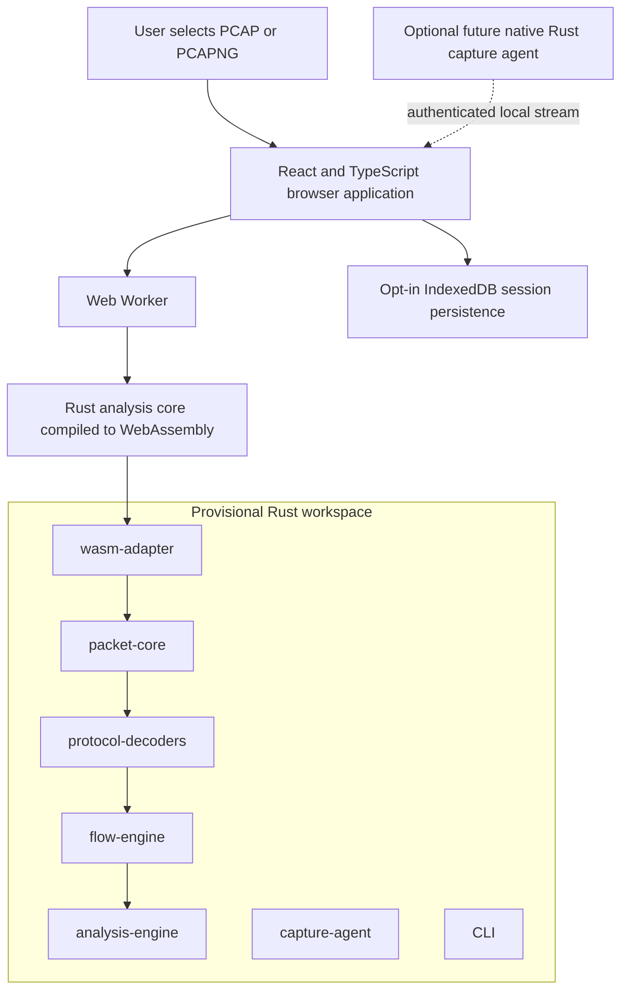

# WireLens

[](LICENSE)

**Inspect PCAP files locally, reconstruct network flows, and understand protocol behavior through a modern interactive interface.**

> **Status:** planning and architecture. WireLens is not yet an implemented packet analyzer.

## The problem

Packet captures contain decisive evidence, but extracting an explanation often requires dense desktop tools, specialist syntax, and careful manual correlation. Learners and experienced engineers alike need a faster way to move from individual frames to a defensible account of what happened.

## Product vision

WireLens will be a privacy-first network investigation application for networking students, developers, network engineers, and security learners. It will combine serious protocol analysis with a modern, searchable, visual investigation experience. The initial product will open `.pcap` and `.pcapng` captures in the browser and analyze them locally.

## Why Rust and WebAssembly

Rust is a strong fit for parsing untrusted binary input because it supports explicit ownership, predictable resource use, and memory-safe abstractions without a garbage collector. Compiling a platform-neutral Rust analysis core to WebAssembly can reuse those correctness-focused components in the browser while keeping expensive work in a Web Worker. The architecture must still validate crate selection, data ownership, browser integration, and performance before implementation begins.

## Privacy first

Packet data can contain credentials, identifiers, private conversations, and proprietary topology. WireLens therefore adopts a local-processing principle: offline capture analysis must not upload packet bytes to a server. Persistence will be opt-in, raw-data export will require an explicit warning, and future live capture will be an optional, authenticated local capability.

## Planned capabilities

- PCAP and PCAPNG import
- Ethernet, VLAN, ARP, IPv4, IPv6, ICMP, TCP, UDP, and DNS decoding
- Searchable, virtualized packet table and structured header inspection
- Raw-byte and decoded-field correlation
- Five-tuple flow reconstruction and TCP connection-state analysis
- Retransmission, reset, handshake, latency, and failure indicators with supporting evidence
- Traffic metrics, conversation timelines, sequence diagrams, and topology visualization
- Privacy-preserving offline operation
- A later native Rust live-capture agent
- Optional future Aya/eBPF-based Linux observability, where justified

## Provisional architecture

Technical boundaries remain open until the first architecture decision record is accepted.



## Proposed repository structure

```text
wirelens/
├── crates/                  # Future platform-neutral Rust workspace crates
├── apps/
│   └── web/                 # Future browser application
├── fixtures/                # Synthetic or explicitly redistributable captures
├── benchmarks/              # Parser, flow, Wasm, and UI performance fixtures
├── docs/                    # Product, architecture, and roadmap documentation
└── .github/                 # Contribution and issue templates
```

This structure is a proposal, not a commitment. No application source code exists yet.

## Roadmap

- **M0 — Foundation:** validate architecture, tooling, repository boundaries, and testing strategy.
- **v0.1 — Offline Packet Viewer:** import captures locally and inspect decoded packets without blocking the browser.
- **v0.2 — Flow Analysis:** reconstruct conversations and explain TCP behavior and failures.
- **v0.3 — Investigation Experience:** complete filtering, visualization, persistence, accessibility, and release hardening.
- **v0.4 — Live Capture:** add an optional authenticated native Rust capture agent after the offline product is stable.
- **v1.0 — eBPF Observability:** evaluate and implement deeper Linux telemetry only where evidence supports it.

Dates are intentionally unset until the architecture spike is complete. See [the detailed roadmap](docs/roadmap.md); links to the GitHub Project and epics will be added after planning issues are created.

## Non-goals for the first release

- Server-side upload, storage, or processing of packet captures
- Live packet capture or privileged native installation
- eBPF telemetry or process/container attribution
- Full parity with Wireshark's protocol coverage or display-filter language
- IPv4/IPv6 fragment reassembly, TCP payload reassembly, or decryption
- Multi-user collaboration or cloud synchronization
- Claiming heuristic conclusions as certainty

## Contributing

WireLens is currently accepting planning, architecture, research, documentation, and test-strategy contributions. Read [CONTRIBUTING.md](CONTRIBUTING.md), [AGENTS.md](AGENTS.md), and the open architecture questions before proposing implementation. Scope changes should be discussed in an issue first.

## Security and responsible capture handling

Treat every packet capture as potentially sensitive and every parser input as untrusted. Never attach private captures to public issues. Use synthetic or explicitly redistributable fixtures, remove identifying data, and follow [SECURITY.md](SECURITY.md) for confidential reports.

## License

WireLens is available under the [MIT License](LICENSE).
